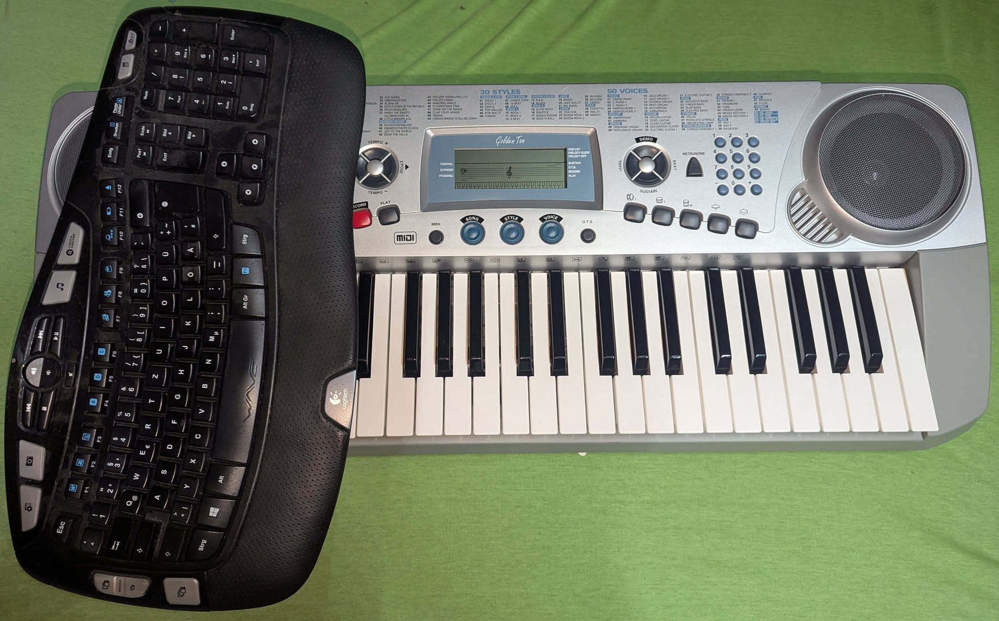

# Accordion Bass MIDI Keyboard

This proof of concept converts USB keyboard input to accordion bass MIDI output.

Digital Accordions are quite rare and expensive.  
Have fun playing around using your favourite MIDI Instruments without the direct need to by one.

Focus has been put on traditional Stradella bass layout.  
As there are ergonomically only 4 rows almost properly spaced you only get counterbass bass major and minor.

## How to Use Ergonomically



Turn your keyboard 90 degrees and place it on the left side of your MIDI keyboard for the best experience.

## 🐸 **LEAP** – **L**et **E**rrors **A**bort **P**romptly
```
Don’t catch what you should crash.  
Crash early, crash clearly, crash fast.
```

**TLDR**: __If it can fail, let it fail – loud, proud and early.__

Principles:
- **Crash early, crash clearly** – Let errors appear immediately instead of hiding them.
- **Expose, don’t obscure** – Avoid over-engineered error handling that masks real problems.
- **Iterate boldly** – Fix issues as they appear, then **LEAP** again.

## Requirements

- Linux (tested on Arch)
- Python 3.8+
- Separate USB keyboard besides your main keyboard (not strictly necessary)

## Setup

```bash
python -m venv .venv
source .venv/bin/activate
pip install -r requirements.txt
```

## Usage
Make sure your user has sufficieend acces rights to `/dev/input`.

```bash
# Start with automatic keyboard detection
python accordion_bass.py

# Or specify device and layout manually  
python accordion_bass.py --device /dev/input/event3 --layout stradella
```

Connect the MIDI port in your DAW.  
I use `Carla Plugin Host` where it is called `RtMidiOut ClientAccordion Bass`.

## Layouts
I use a english linux system but german QWERTZ keyboard layout, so maybe you need to fix mapping.

### Stradella
Main config is `config/stradella_layout.yml` as following:

|      | Keys                                 | MIDI Channel |
|--------------|--------------------------------------|--------------|
| Counterbass  | [1][2][3][4][5][6][7][8][9][0][ß][`] | 3            |
| Bass Notes   | [Q][W][E][R][T][Z][U][I][O][P][Ü][+] | 3            |
| Major        | [A][S][D][F][G][H][J][K][L][Ö][Ä][#] | 2            |
| Minor        | [Y][X][C][V][B][N][M][,][.][-][Shift][Space] | 2      |

MIDI Channel 1 is used for control communication.


### Circle of Fifths
Layout `config/circle_layout.yml` derived from Stradella but arranges bass notes in circle of fifths order (Ab-Eb-Bb-F-C-G-D-A-E-B-F#-C#). Instead of chords, the major/minor rows duplicate the bass notes in higher octaves (octave 2 and 3) on MIDI channel 2.

This works particularly well with tonewheel organs where playing full chords would sound too cluttered with all the drawbars pulled out - single notes in different octaves provide harmonic richness without the density.


### SimpleBass Layout
Alternative config is `config/simplebass_layout.yml` which follows a simple pure chromatic schema across 4 octaves:

|          | Keys                                      | MIDI Channel |
|-------------|-------------------------------------------|--------------|
| Row 1 (C1-B1)   | [1][2][3][4][5][6][7][8][9][0][ß][´]      | 3            |
| Row 2 (C2-B2)   | [Q][W][E][R][T][Z][U][I][O][P][Ü][+]      | 3            |
| Row 3 (C3-B3)   | [A][S][D][F][G][H][J][K][L][Ö][Ä][#]      | 2            |
| Row 4 (C4-A#4)  | [Y][X][C][V][B][N][M][,][.][-][Space]     | 2            |

